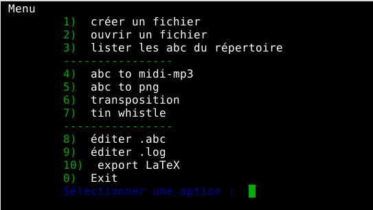

# script abcnotation.sh
Développé _en bash shell_ sous système  GNU/Linux Debian 10 (buster)

Ce script utilise plusieurs commandes via un menu pour rendre plus conviviale la notation _abc_. 

   
_This script uses several commands via a menu to make the abcnotation more user-friendly_     
_Ĉi tiu skripto uzas plurajn programaĵojn per menuo por plifaciligi la "abc"-skribmanieron_

## Utilitaires dans le script
>* abcm2ps
>* abc2midi
>* abc2abc
>* lame et timidity 
>* nano (par défaut)

## Fonctions
>* créer un fichier _abc_
>* ouvrir/éditer un fichier _abc_
>* lister les fichiers _abc_ du répertoire courant
>* lister les fichiers d'après un motif se trouvant à l'intérieur des fichiers _abc_ (ex : K:G)
>* fichier _.eps_
>* fichiers _.mid_ et _.mp3_
>* fichier _.png_ (croppé)
>* transposition _.abc_ vers _\_transpose.abc_
>* tin whistle (C, D ou G)
>* fichier _.log_
>* export LaTeX (pour package _abc_)

## Utilisation
* Le script doit être situé dans le répertoire de travail.     
(_The script should be in the working directory_)    
(_La skripto devas esti en la labora dosierujo_)

* Les fichiers produits se trouvent dans le répertoire de travail.    
(_The produced files are located in the working directory_)    
(_La produktitaj dosieroj troviĝas en la labora dosierujo_)

_chmod +x abcnotation,.sh_ pour rendre le script exécutable

## Test
Deux fichiers en exemple :     
_Two example files_    
_Du ekzemplaj dosieroj_
 
  
* gitane.abc   
* br_mon_arbre.abc (Brassens)

Ces fichiers doivent être dans le même répertoire que le script (amélioration bienvenue)    
_These files must be in the same directory as the script (welcome improvement)_    
_Ĉi tiuj dosieroj devas esti en la sama dosierujo kiel la skripto (plibonigo estas bonvena)_

Le fichier flute.fmt sert au tin whistle.    
_The flute.fmt file is used for tin whistle._   
_La dosiero flute.fmt estas uzata por stanfajfilo._
